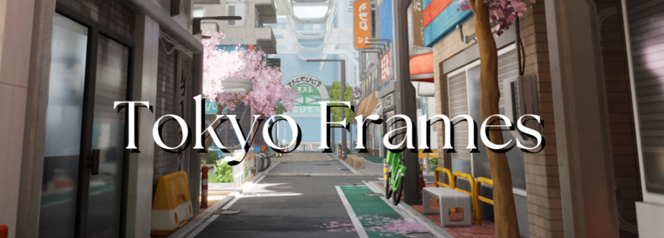

### [Itch.io Game Page](https://skyl1ne0.itch.io/tokyo-frames)

### About the Game

This project was my first completed game in Unreal Engine 5, set in a stylized Tokyo 
environment centered around photography. Through this project, I delved into 
Unreal's Blueprint system, enhancing my skills in gameplay mechanics and UI programming. 
I learned techniques for player control and dynamic camera manipulation, developed custom 
input mappings for events, designed audio, and created responsive menus, including a fully 
functional graphics options menu.

### Controls

Exploration
- WASD - Move
- E - Open Photo Mode
- F - Cycle Day/Night time
- Esc - Pause Game

Photo Mode
- LMB/RMB - Zoom In/Out
- X/C - Roll Camera Left/Right
- Spacebar - Take Photo
- Tab - Exit Photo Mode

Photos will be saved in the game local folder under:
```bash
TokyoFrames/Windows/Photos
``` 